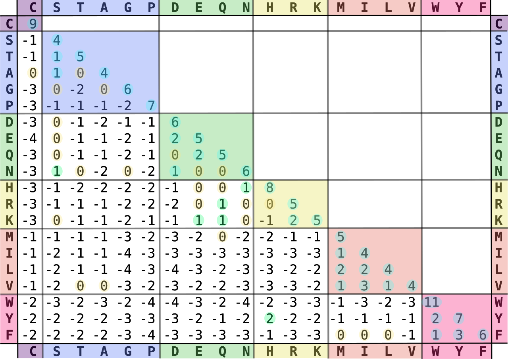
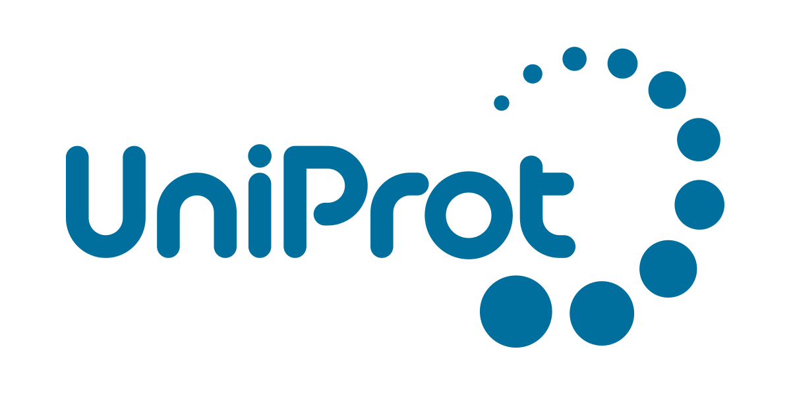

<!-- _class: lead -->
<!-- _paginate: false -->

# Building EMERALD-UI
## a protein alignment visualization tool for EMERALD

Presenter: Andrei Preoteasa  
Research Group: Algorithmic Bioinformatics Lab  
Project: [emerald-ui](https://algbio.github.io/emerald-ui)

---

# Presentation Structure
## What We'll Cover Today

1. **Background & Motivation**  

2. **Limitations of Traditional Methods**  

3. **EMERALD Algorithm**  

4. **EMERALD UI Overview**  

5. **Technical Implementation**  

6. **EMERALD-UI In Action**

---
# Background & Motivation
## Why Protein Alignment Matters

Proteins are the workhorses of biology, and comparing their sequences helps us understand function, evolution, and disease.

#### Example Protein Alignment:
```
A: MKTAYIAKQRQISFVKSHFSRQ
B: MKTA--AKQRQISFVKSHFSRQ

Match: +5   Mismatch: -2   Gap: -6
```
---

### How Are Proteins Aligned?
- **Sequence alignment algorithms** compare amino acid sequences to find similarities.
- **Cost matrices** (e.g., BLOSUM, PAM) assign scores for matches, mismatches, and gaps.
- The goal: **maximize total score** by aligning similar regions and penalizing differences.

<center>

<br><i>BLOSUM62 substitution matrix showing amino acid similarity scores</i>
</center>


---

# Issues in Protein Alignment

- **Multiple Valid Alignments:** Different alignments may be equally plausible.
- **Gap Placement:** Deciding where to insert gaps affects biological interpretation.
- **Scoring Bias:** Choice of cost matrix influences which regions align.
- **Functional Relevance:** Not all aligned regions are biologically meaningful.

---

Instead of finding **one "optimal" alignment**, what if we could:

- **Explore the alignment landscape** - Find all good alignments, not just the best  
- **Identify trustworthy regions** - Discover where alignments consistently agree  
- **Reduce scoring bias** - See robust patterns across different parameters  
- **Focus on functional relevance** - Highlight biologically meaningful regions  

### The EMERALD Approach:
> **If multiple high-scoring alignments agree on a region,  
> that region is probably functionally important!**

This is exactly what **EMERALD** does - it reveals which parts of your alignment you can trust.

---

# EMERALD by itself

**EMERALD** is a terminal application for generating protein alingments written in C++.


### Issues
- App only gives raw data, which is hard to interpret
- Only work in the terminal, which is hard to use
- Limited input methods

<center>

</center>


---
# How EMERALD-UI Solves These Problems

- **Intuitive Visualization:** Draws an interactive, easy-to-use graph from raw EMERALD output.
- **Accessible Interface:** Runs in the browser, no terminal required.
- **Flexible Input:** Paste sequences, upload files, or search directly from UniProt.
- **Alignment Confidence:** Highlights common areas of multiple alignments.
- **Parameter Exploration:** Instantly adjust scoring and see how alignments change.
- **Safety Windows Visualization:** Highlights common regions in 3D structures of proteins.

---

# Technology Stack

<table>
    <tr>
        <td align="center">
            <br>
            <b>React</b><br>
            Modern UI framework for building interactive web applications.   <td align="center">
                <br>
                <b>TypeScript</b><br>
                Type-safe code for reliability and maintainability.
            </td>    </td>
            <td align="center">
                <br>
                <b>WebAssembly (WASM)</b><br>
                Runs EMERALD executable in-browser.
            </td>
            </tr>
            <tr>
            <td align="center">
                <br>
                <b>D3.js</b><br>
                Interactive, data-driven visualizations.
            </td>
            <td align="center">
                <br>
                <b>UniProt API</b><br>
                Direct protein sequence search.
            </td>
            <td align="center">
                <br>
                <b>Mol*</b><br>
                3D protein structure visualization.
            </td>
    </tr>
</table>

---

# Demo Time

## Let's see EMERALD-UI in action!
---

<!-- _class: lead -->

# Thank You!

## Questions?

Feel free to ask about EMERALD-UI, protein alignment, or anything from today's presentation.

